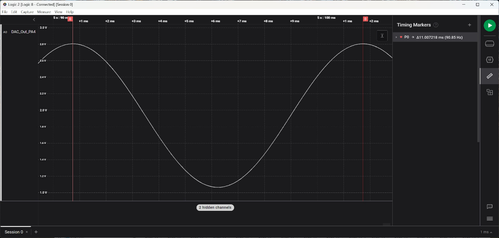

# ECEN-361 Lab-08: DMAs with ADC/DAC

## Introduction and Objectives of the Lab

Part 1: Learn how a Sine Wave can be created from a µController and investigate the characteristics and limitations of an ADC Controller (the one built into the STM32)

Part 2: Exposure to and use of DMA channels in a µController.

Part 3: *(TBD 2nd week: Use an external graphing tool to measure a signal on the STM32 Board.)*

For each of the parts, follow the instructions, then fill in answers to the questions. Expected answers are indicated in the boxes with red text/spaces to fill in answers.

## Overview of System

The project, as configured in the repo, is a bare-metal (no FreeRTOS) that is configured like this:

Explore the GUI by opening the  **ECEN-361-STM32-Lab-08-Sampling-Solution.ioc** file to see the configurations.

In this configuration, the DAC drives an analog sinewave ouput which is wired (external jumper wire) from its output pin, back to an ADC input pin. The transfers are set up to be done automatically, via DMA channels. Once these channels are configured, no uProcessor cycles are required to effect the transfer out (DAC) or the transfer in (ADC). The DMAs are configured to automatically:

- Read from a memory buffer (cyclically) and write to a fixed peripheral address (DAC).
- Read from a peripheral I/O address (ADC) and write to a memory buffer (cyclically).

### Sine Wave Generation

Often, in embedded systems with limited compute power, an output waveform (like a Sine Wave) is created by calculating the points of the wave thru a cycle. Tools help generate these, depending on the number of points per cycle, the output voltage displacement, etc. In this approach, a memory value is read, its analog value put out to the pin in a periodic manner. For this lab, a simple web-based calculator ([SEE HERE](https://deepbluembedded.com/sine-lookup-table-generator-calculator/)) created the integer values of the sine wave over time. If these are plotted over time, they look like this (depending on the number of points):

In this simplistic version, only 10 points / cycle are used, so the wave re-creation is crude:

The values to create the wave are put in an integer array, sequentially providing the points of the sine wave – See the ‘**sinewavetable.h’** include file in the project. For the lab, three different arrays have been populated with values of differing points per cycle to make up a single period:

- `const uint16_t sineLookupTable_10_pts[];`
- `const uint16_t sineLookupTable_100_pts[];`
- `const uint16_t sineLookupTable_1000_pts[];`

We’ll compare the outputs of using different points/sample in this lab.

## Questions

* Look at the sine wave tables in the include file.  What is the range of the values in the tables for each of the differing points/cycle?
  
  <mark>[*answer here*]</mark>

* If this is going to the DAC, explain the ranges stored in the table
  
  <mark>[*answer here*]</mark>

## Part 1: Looking at the Sine Wave Output

1. Connect the DAC out to the ADC in
   
   You’ll need a single jumper (from your ECEN-106 kits or available during lab time). Connect the DAC-out to the ADC-in (CN-7.32 CN-7.37)

2. Run the code.
   
   Your board should show “1000” on the 7-seg display
   
   The 7-Seg LEDs indicate which of the points-per-cycle table is being used to output the DAC waveform.:10, 100, 1000. These values are cycled by pressing **S1**.   
   
   

3. Look at the analog wave out with the Saleae Logic Analyzer.
   
   Connect / Configure the Logic Analyzer, same as previous labs, to use one of the inputs in analog mode. Connect the probe to the one of the red jumper wire endpoints, and connect a ground on the probe header.
   
   Cycle through the different points/cycle option (Switch S1) – you should see something like this, with differing smoothness:
   
   100 Points / Sample
   
   
   
   1000 Points / Sample
   

---

Set the triggering to loop and adjust the sample rate and length of sample to get a good picture of each of the three different waveforms. Note that you can auto-adjust the vertical size of the analog wave to get a more readable picture. Use the ruler tool (shortcut: \<CTRL\>-T) to get accurate time differences.

### Questions (2 pts)

* Measure the three waveforms and fill out the following table:
  
  | WaveformPoints / Cycle  | 10                           | 100                          | 1000                         |
  | ----------------------- | ---------------------------- | ---------------------------- | ---------------------------- |
  | Period of Wave          | <mark>[*answer here*]</mark> | <mark>[*answer here*]</mark> | <mark>[*answer here*]</mark> |
  | Time between each point | <mark>[*answer here*]</mark> | <mark>[*answer here*]</mark> | <mark>[*answer here*]</mark> |

* Take/Paste a screenshot showing the measurements of each of the three samples/cycle, showing the frequency measurements.
  
  <mark>[*screenshot here -- place image in media/ directory*]</mark>

---

The DMA controller has been configured to run cyclically – meaning after all the buffer entries are read, the DMA controller starts over again and reads sequentially thru the addresses. This continues as long as the DMA is enabled.

The timing of the DAC conversions can be free-running  
(“No trigger” = go as fast the conversion time allows) or based on a trigger. For this lab, the trigger has been configured to be one of the timers – Timer2.

**See the .IOC GUI:**

This means that the DAC conversion will start only as often as the Timer2 Trigger happens.

**Timer2 is configured:**

As configured, the timer should call for a conversion

80 Mhz / 80 (pre-scaler) / 1000 == 1 KHz. Every mS.

By adjusting Timer2, you can change the frequency of the sinewave coming from the DAC.

## Questions (3 pts)

* Adjust Timer2, recompile each time, and measure to fill in the tables.  If the system breaks put “breaks” in the box.

| Case “A”        | Prescaler: 79        | Counter Period: 10000        |
| --------------- | -------------------- | ---------------------------- |
| 10 Pts/Cycle:   | Period of wave:      | <mark>[*answer here*]</mark> |
|                 | Time between points: | <mark>[*answer here*]</mark> |
| 100 Pts/Cycle:  | Period of wave:      | <mark>[*answer here*]</mark> |
|                 | Time between points: | <mark>[*answer here*]</mark> |
| 1000 Pts/Cycle: | Period of wave:      | <mark>[*answer here*]</mark> |
|                 | Time between points: | <mark>[*answer here*]</mark> |

| Case “B”        | Prescaler: 79        | Counter Period: 1            |
| --------------- | -------------------- | ---------------------------- |
| 10 Pts/Cycle:   | Period of wave:      | <mark>[*answer here*]</mark> |
|                 | Time between points: | <mark>[*answer here*]</mark> |
| 100 Pts/Cycle:  | Period of wave:      | <mark>[*answer here*]</mark> |
|                 | Time between points: | <mark>[*answer here*]</mark> |
| 1000 Pts/Cycle: | Period of wave:      | <mark>[*answer here*]</mark> |
|                 | Time between points: | <mark>[*answer here*]</mark> |

| Case “C”        | Prescaler: 7         | Counter Period: 100          |
| --------------- | -------------------- | ---------------------------- |
| 10 Pts/Cycle:   | Period of wave:      | <mark>[*answer here*]</mark> |
|                 | Time between points: | <mark>[*answer here*]</mark> |
| 100 Pts/Cycle:  | Period of wave:      | <mark>[*answer here*]</mark> |
|                 | Time between points: | <mark>[*answer here*]</mark> |
| 1000 Pts/Cycle: | Period of wave:      | <mark>[*answer here*]</mark> |
|                 | Time between points: | <mark>[*answer here*]</mark> |

| Case “D”        | Prescaler: 7         | Counter Period: 5            |
| --------------- | -------------------- | ---------------------------- |
| 10 Pts/Cycle:   | Period of wave:      | <mark>[*answer here*]</mark> |
|                 | Time between points: | <mark>[*answer here*]</mark> |
| 100 Pts/Cycle:  | Period of wave:      | <mark>[*answer here*]</mark> |
|                 | Time between points: | <mark>[*answer here*]</mark> |
| 1000 Pts/Cycle: | Period of wave:      | <mark>[*answer here*]</mark> |
|                 | Time between points: | <mark>[*answer here*]</mark> |

* Are the results predictable and correlated with the timer?  What would the FREQUENCY be with 1000 pts/cycle if the Timer2 had:  Prescaler=799, Counter_Period=100?
  
  <mark>[*answer here*]</mark>

* When the trigger for the DAC DMA  (Timer2) was set to go too fast, what happened?
  
  <mark>[*answer here*]</mark>
  
  Any ideas why?
  
  <mark>[*answer here*]</mark>

* Sending out the DAC via the DMA, the point-to-point timing gets set by the trigger frequency. Could a polling-based approach be faster (supposing the DAC conversion time was zero)? If so, why use DMA?
  
  <mark>[*answer here*]</mark>

## Extra Credit (5 pts maximum)

* Note on the analog waveform from the DAC that the nadir (lowest point) of the waveform doesn’t go all the way to 0.0Volts.  It looks to be “clipped” at about 0.6 V.   Explain why :
  
  <mark>[*answer here*]</mark>

* Doing a S/W-only solution to output the values to the DAC (Called: “Programmed I/O”) requires a simple loop of :
  
  a.    Read the next digital out from the table
  b.    Output it to the DAC
  c.    Poll to see if the DAC conversion is done
  d.    Repeat
  
    Write a procedure of the non-DMA version of the wave generator and see how fast you can make the frequency.  Comments about it:
  
  <mark>[*answer here*]</mark>

* We used Timer2 as a trigger to define the timing between each waveform point. Can the DMA control be modified so that it runs continuously without a trigger? How would you do this? Show a screenshot of code snippet of your approach.
  
  <mark>[*answer here*]</mark>
